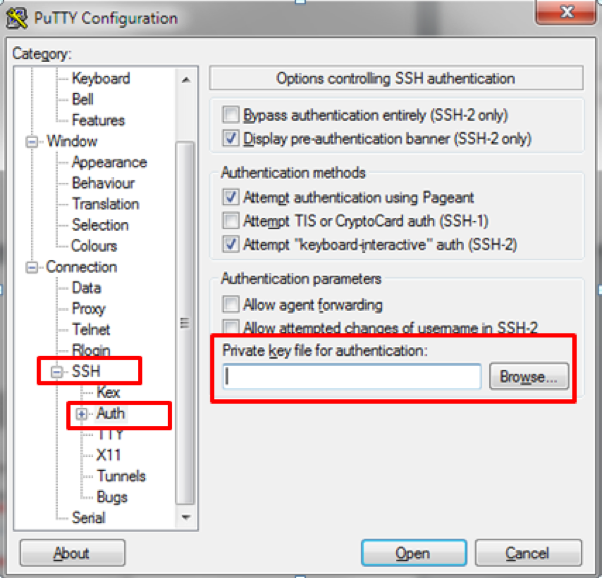

# Lab Setup 
To access the lab machine you need to download the GitHub repository. 
Go to the [repo](https://github.com/jruels/ms-labs) and in the top right corner click the green "Code" button, then click "Download as zip". 
Once the download is done extract the zip file to somewhere you can easily access it. 

## macOS
On macOS, or Linux use the terminal to connect to the lab machine.

### Set permission on SSH key 
```
chmod 600 ms-labs-main/keys/lab.pem
```

### SSH to lab servers 
The username for SSH is `ubuntu`
```
ssh -i ms-labs-main/keys/lab.pem ubuntu@<LAB IP> 
```


## Windows 
On Windows use Putty to access the lab machine.   
Open Putty and configure a new session. 
  


Expand “Connection_SSH_Auth and then specify the PPK file from the `keys` directory 


 Now save your session    


